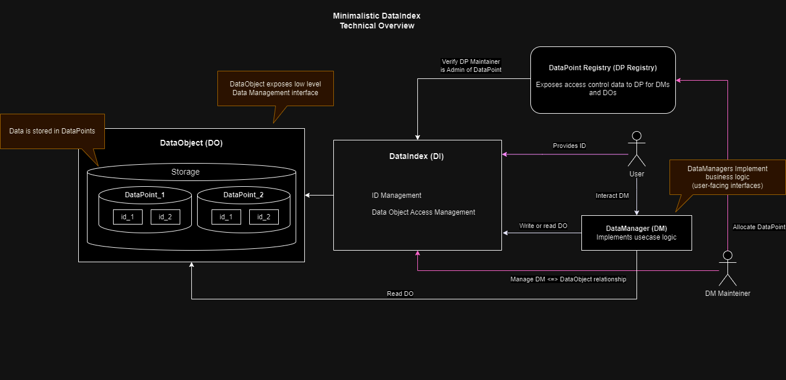

<div align="center">
 
# **Minimalistic ODC (ERC-7208) - Example Implementation** <!-- omit in toc -->


[](https://opensource.org/licenses/MIT)

[EIP-7208](https://eips.ethereum.org/EIPS/eip-7208) • [Nexera Network](https://www.https://www.nexera.network/) • [Documentation](https://docs.nexera.network/nexera-standard/overview) • [Code](https://github.com/Nexera-Foundation/Minimalistic-ERC-7208/)

</div>

- [1. What is ERC-7208](#-1-what-is-ERC-7208)
- [2. What brings Minimalistic](#️-2-what-brings-minimalistic)
- [3. Architecture](#-3-architecture)
- [4. How to Set Up](#-4-how-to-set-up)
- [5. Deploying and setting up contracts](#-5-deploying-and-setting-up-contracts)
- [6. Tests](#-6-tests)
- [7. Utility scripts](#-7-utility-scripts)
- [8. Contributing](#-8-contributing)
- [9. License](#-9-license)

## 🔌 **1. What is ERC-7208**

[ERC-7208](https://eips.ethereum.org/EIPS/eip-7208) (a.k.a. On-Chain Data Containers) provides a modular interface for managing on-chain data, designed to decouple storage from logic in smart contracts.

This separation creates a highly flexible framework where assets can be "wrapped" into **Data Objects** (dedicated storage contracts), and logic is handled through **Data Managers** (interfaces defining behavior).

This architecture allows for easy adaptation, upgrading, and interoperability across any current or future tokenization standards.

The core innovation lies in upgrading business logic independently of the storage layer, offering a robust, future-proof solution that supports tokenization, identity, compliance mechanisms, omnichain operations, and much more.

In other words: This standard enhances the compatibility of tokenized assets with existing infrastructures and protocols built for Web3.

The current market encourages innovation and the evolution of standards that were previously designed to address specific needs. These standards were not always compatible with existing products, dApps, or protocols.

[ERC-7208](https://eips.ethereum.org/EIPS/eip-7208) is designed to be a timeless standard, capable of adapting to current market needs, future compliance requirements, and emerging technologies such as new standards. By abstracting the logic within the storage, ODCs encourage an architectural design allowing for easy adaptation and interaction between multiple protocols and dApps.

You should consider using this framework if your on-chain architecture requires:

1. **Making assets interoperable**: For example, by issuing assets under a specific standard (i.e. ERC-721/ERC-1155) and after deployment, enabling trading such assets through a different interface (i.e. ERC-20 token for accessing liquidity).

2. **Adapting one standard to another**: For example, if you are collecting ERC-721 NFTs and want to make them Rentable (ERC-4907).

3. **Modifying the logic of a particular asset**: For example, If your project uses ERC-20 for a certain RWA/security token and the regulatory framework in your current jurisdiction has changed, requiring you to implement embedded compliance rules (such as [Compilot](https://www.compilot.ai/) on-chain Gating mechanism or ERC-3643).

4. **Any use-case where you would benefit from a modular architecture design**: For example, if you are building an ecosystem of smart contracts that are expected to change and require mutability, extensibility, or adaptability.

For more detailed explanation, please visit [Ethereum EIPs](https://eips.ethereum.org/EIPS/eip-7208).

## ⚪️ **2. What brings Minimalistic**

This repository contains a simple, educational-purpose implementation following Onchain Data Index (ERC-7208).
Please, do not use this example for production, if you want to implement ERC-7208 go to [Contributing](#🤝-Contributing) or contact [Nexera](https://www.nexera.network/).

## 🔬 **3. Architecture**


### 3.1. Naming conventions

- **DataPoint (DP):** Bytes32 indexed lowl-level data storage.

- **DataPoint Registry (DPR):** Defines Access management and DataPoint compatibility.

- **Data Indexer: (DI)** Mediates between Access management and Data Objects.

- **Data Manager (DM):** Interface for the user, implements business logic.

- **Data Object (DO)**: Defindes the logic of the data management.

### 3.2. Overview

The Data Index is a smart contract entrusted with access control. It is a gating mechanism for Data Managers to access Data Objects. If a Data Manager intends to access a Data Point (either by read(), write(), or any other method), the Data Index should be used for validating access to the data.

Data Objects are entrusted with managing transactions that affect the storage of Data Points. Data Objects can receive read() and write() from a Data Manager requesting access to a Data Point. As such, Data Objects respond to a gating mechanism given by a single Data Index.

Data Points are the low-level structure abstracting information, in other words, labels for the application's data. Data Points are allocated by a Data Point Registry, and this information should be stored within its internal structure. Each Data Point should have a unique identifier provided by the Data Point Registry when instantiated.

Data Managers are independent smart contracts that implement the business logic or “high-level” data management. They can either read() from a Data Object address and write() via a Data Index Implementation managing the delegated storage of the Data Points. Data Managers can include desired interfaces to follow a standard (ERC20, ERC721, ERC1155, ERC3643, etc.) .

### **Simplified diagram**



As an example implementation of a Data Manager this repository includes the `MinimalisticERC1155WithERC20FractionsDataManager.sol` contract which is a Data Manager that exposes the ERC1155 functionality where each token ID can be treated as an individual ERC20 token through the use of the `MinimalisticERC20FractionDataManager.sol`.

To be able to do this, the `MinimalisticERC1155WithERC20FractionsDataManager.sol` contract uses the `MinimalisticFungibleFractionsDO.sol` Data Object which stores the necessary information to manage the id, balances, and total supply of the tokens.

## 🚀 **4. How to Set Up**

### _This repository requires some familiarity with:_

- [Solidity](https://docs.soliditylang.org/en/latest/)
- [yarn](https://yarnpkg.com/getting-started)
- [TypeScript](https://www.typescriptlang.org/)
- [hardhat](https://hardhat.org/)
- [ethers.js](https://docs.ethers.io/v5/)

### 4.1. Clone the repository

```
git clone https://github.com/Nexera-Foundation/Minimalistic-ERC-7208.git
```

### 4.2. Install dependencies

```
yarn & yarn install
```

### 4.3. Build contracts

```
yarn build
```

## ✨ **5. Deploying and setting up contracts**

### 5.1. Deploy core contracts (Data Index and Data Point Registry)

```
yarn deploy:core --network <network>
```

### 5.2. Deploy Data Objects and Data Managers

To deploy the examples, the associated Data Point and metadata must first be set in the [constants.ts](./utils/constants.ts) file.
To create a new Data Point see [Allocate Data Point](#allocate-data-point).

```
yarn deploy:examples --network <network>
```

After deploying the contracts, the Data Manager must be allowed to manage the information associated with the Data Point in the Data Object by calling the `allowDataManager` function in the Data Index contract. Then the Data Index implementation must be set and linked to the Data Point in the Data Object by calling the `setDataIndexImplementation` function in the Data Object contract.

---

Until this point, most of the Data Managers are ready to be used, but in this implementation, the `MinimalisticERC1155WithERC20FractionsDataManager.sol` contract needs to be admin of the Data Point to be able to allow the `MinimalisticERC20FractionDataManager.sol` contract to manage the Data Point when they are deployed. To do this the `MinimalisticERC1155WithERC20FractionsDataManager.sol` contract must be admin of the Data Point calling the `grantAdminRole` function in the Data Point Registry contract.

The script [Set up Data Manager](#set-up-data-manager) can be used to execute the previous steps.

## 🛠 **6. Tests**

For running the tests, you will need to run this command :

```
yarn test
```

If you want to run linting or check the contracts size:

```
# Lint (Smart contracts)
yarn lint:contracts

# Lint (TS files)
yarn lint:ts

# Checking contracts size
yarn contract-size
```

## 📝 **7. Utility scripts**

### Allocate Data Point

```
yarn allocateDataPoint --network <network>
```

### Set up Data Manager

To set up the Data Manager the associated Data Point must first be set in the [constants.ts](./utils/constants.ts) file.

```
yarn setUpDataManager --network <network>
```

## 🤝 **8. Contributing**

Thank you for your interest in ERC-7208!

Please contact [Nexera](https://www.nexera.network/) to integrate all your interactions with the project.

## 📜 **9. License**

Note: This component currently has dependencies licensed under the MIT license.
